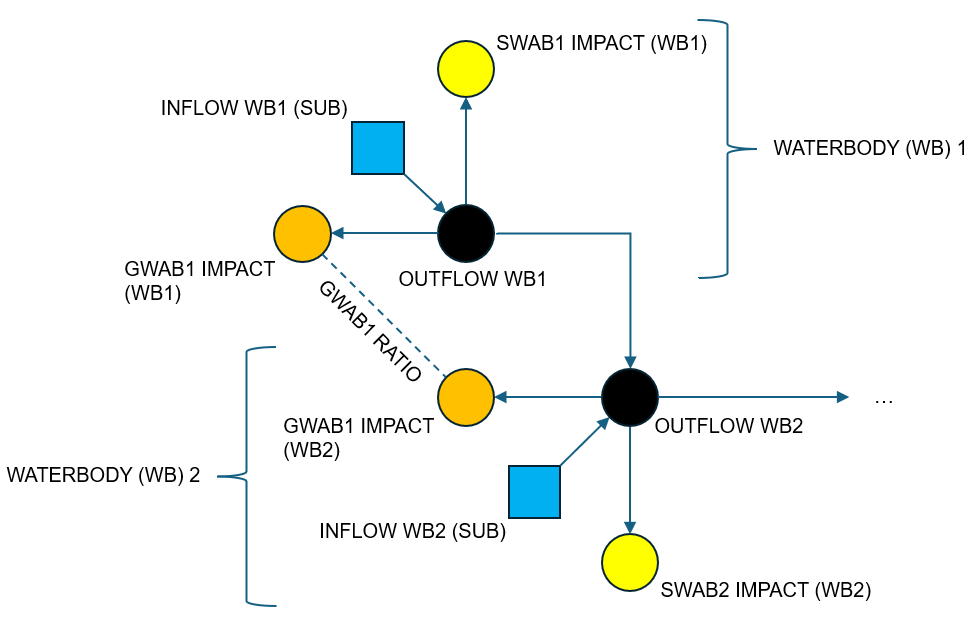

Optimiser
=========

The Optimiser identifies potential artificial influence changes that could achieve flow
targets by solving an optimisation problem. Similar to the Calculator, the starting
point could be the "base" WRGIS tables or a modified/alternative version of "WRGIS-like"
tables. Key outputs from this component include updated tables of how the artificial
influence impacts were changed by the solver to help meet flow targets.

Conceptualisation
-----------------

For the Optimiser we conceptualise waterbodies and artificial influences as nodes in a
network. The network can be thought of as follows (see also the diagram below for a
very simple hypothetical case):

    - Waterbody nodes are connected via directed edges/arcs to their downstream
      neighbours according to the relationships given in WRGIS.
    - Each waterbody node has an inflow, which represents runoff generated within the
      waterbody (i.e. "sub" flows). These inflows are set as natural "sub" flows unless
      any artificial influences are being held constant, in which case inflows are
      adjusted to account for these impacts upfront. See below for more details.
    - Aside from any held constant, each artificial influence also has a node. A
      directed edge connects the impacted waterbody to the relevant artificial
      influence.
    - Each artificial influence node has a target impact. For abstractions, the nodes
      are therefore similar to demand nodes in water resources systems modelling.
    - Groundwater abstractions that impact multiple waterbodies have multiple nodes,
      one per impacted waterbody. The target impacts for a given groundwater abstraction
      are held in the proportions given in WRGIS (see :doc:`data`).

The problem then is to find the optimal set of flows along all of the edges, according
to some objective(s) and constraints that we define. Note that (for now at least) we
have one network problem for each combination of artificial influences scenario and
flow percentile that we are interested in.

Once solved, by looking at the relevant edges we can get at the following terms:

    - Waterbody outflows (i.e. "ups" scenario flows), for which we can then calculate
      surpluses/deficits and compliance classifications.
    - Actual artificial influence impacts. These impacts may be less than the target
      impacts if (i) the target impacts are not possible and/or (ii) a lower impact
      is identified by the solver as resulting in the optimal solution.

For the latter set of edges, we can compare the actual impacts with the target impacts
to back out the required impact changes - i.e. the key output of the Optimiser.

Simplifications
---------------

At this point it is worth introducing a couple of simplifications currently made in
the Optimiser:

    - Discharges are held constant in the solution at present, i.e. they are not
      adjusted by the solver either to help meet flow targets or to maintain some
      relationships with abstractions. Therefore, currently discharges are held
      constant (by adding their impact to the relevant inflow terms in the waterbody
      network).
    - Complex impacts are also held constant in the solution currently. Work is
      underway to allow for selected types of these influences to be incorporated in
      the solution. For now they are accounted for upfront, again by adjusting the
      relevant waterbody inflow terms.

Problem Definition
------------------

The network flow conceptualisation outlined above can be formulated and solved via the
linear programming family of methods. For this, we need to define "optimal" in our case
and express it as an objective(s). We also need to define the conditions that must be
satisfied in a solution as a set of constraints.

Objective(s)
~~~~~~~~~~~~

One natural objective for this problem is to minimise the total abstraction impact
reductions needed to meet flow targets. This is equivalent to maximising the total
abstraction impact up to the limits imposed by the abstraction scenario. This is the
the currently recommended primary objective for the Optimiser.

The Optimiser supports solution for multiple objectives via a sequential approach. For
example, after solving for the primary objective, the primary objective can effectively
become a constraint and we can solve for a secondary objective.

Testing so far has largely used a (proportional) equality metric as a secondary
objective. This is on the basis that it is better to distribute relative impact
reductions equally amongst abstractors, rather than unequally, if possible. The nature
of the problem is such that solutions for the primary objective (minimum impact
reduction) can easily be non-unique, with the solver returning a potentially arbitrary
choice of solution from the optimal set. There is thus a need/opportunity to nudge the
solution choice to one with desired properties.

For this secondary objective, we seek to maximise the equality of the proportions of
target abstractions fulfilled at the point scale. We quantify equality as the mean
absolute deviation from a target proportion. The target proportion is taken as the
proportion of total abstraction fulfilled in the solution associated with the primary
objective. The mean absolute deviation from this target is then generally lower
(better) if all abstraction points have similar proportional impact fulfillment to
the target proportion.

.. note::

    For large domains including multiple catchments, the Optimiser will evaluate the
    target proportion (and the mean absolute deviation) for each catchment. Catchments
    will be identified as all waterbodies upstream of - and including - the most
    downstream waterbodies in the domain passed to the Optimiser.

Constraints
~~~~~~~~~~~

Several constraints are applied in the problem formulation, regardless of the objective
being used. These constraints may be summarised as:

    - Edge flows must be non-negative.
    - Abstraction impacts must not exceed their target rates.
    - Waterbody outflows must be greater than or equal to their target flows. I.e. flow
      targets are a hard constraint.
    - Mass balance principles must be respected, such that the sum of inputs to and
      outputs from a waterbody must be equal. Inputs are inflows from upstream neighbour
      waterbodies that flow into the waterbody in question, as well as runoff generated
      within the waterbody and any discharges within the waterbody. Outputs are the
      waterbody outflow to its downstream neighbour and any abstractions within the
      waterbody.
    - Groundwater abstractions that impact multiple waterbodies must do so according to
      the fixed ratios given in WRGIS. For example, if a groundwater abstraction's
      total impact is split between two waterbodies in a ratio 2:1 in WRGIS, this ratio
      must be respected in the solution.
    - Hands-off flow (HOF) conditions must be respected for the surface water
      abstractions to which they apply.

The final constraint listed above constitutes a threshold condition. If flow drops
beyond some threshold then an abstraction must be switched off. If flow is above the
threshold then an impact can take place up to the target rate. This transforms the
problem from a pure linear programming problem into a mixed integer (binary) linear
programming problem.

As noted above, if a solution is being sought for a secondary objective, the primary
objective is applied a constraint on the solution. In the current setup, this means
that the optimal maximum total abstraction found when solving for the primary objective
is included as an additional constraint when seeking a solution for the secondary
(equality) objective.

We can also observe now that the issue of "capping" discussed in :doc:`calculator` is
dissolved by the formulation for the Optimiser to some extent. The non-negativity
constraint prevents scenario flows becoming negative, i.e. abstraction impacts on flows
have to remain compatible with non-negative scenario flows.

.. note::

    If a target cannot be feasibly met, it will be dropped and a warning message
    displayed. This situation can occur if some impacts are held constant (e.g. complex
    impacts) that have a large effect on flows. See :doc:`reference-optimise` for more
    details.

.. note::

    One possible case where a groundwater abstraction could be higher than its impact
    on flows is if a waterbody outflow target is zero. In this case, so long as
    other constraints are respected, it could be possible to have a groundwater
    abstraction that exceeds the total impact on flow. This may not be relevant in most
    cases, where targets will be above zero, but the handling of this situation could
    be refined in future.

Trade-Offs
----------

If running with two (sequential) objectives, it is possible to explore trade-offs
between objectives. This is achieved by solving for the primary objective and then
"relaxing" its total abstraction impact result before applying it as a constraint on
the secondary objective. This process can be done repeatedly to explore how
successively larger relaxations (i.e. degrading the primary objective) affect the
secondary proportional equality objective (or other metrics).
